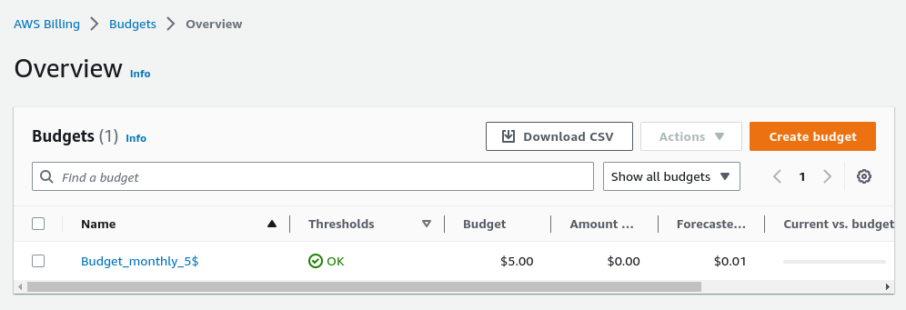

# AWS Cloud Project BootCamp 
### Week 0 billing and architecture 

### Activities in AWS:
- Create AWS account.
- Create admin account.
- Secure both accounts with MFA.
- Create billing alarm.

## Activity in Lucid:
- create napkin diagram for an application
[Lucid share link](https://lucid.app/lucidchart/ccb2587a-5f34-4b57-9154-c70c5a53e89a/edit?viewport_loc=200%2C-418%2C2507%2C1635%2C0_0&invitationId=inv_7de4b202-274c-41c9-81dd-cd6051e88670)


## Install AWS cli 
#### Prepare enviornment 
1. Linux machine
    I use vagrant to prepare linux VM to let my PC clean as posible.
    I use Fedora 37 to install aws cli.
    ```vagrant
      config.vm.define "aws" do |amazon|
    amazon.vm.box = "generic/fedora37"
    amazon.vm.hostname = "aws01"
    amazon.vm.provider :libvert do |aws01|
        aws01.cpus = 2
        aws01.memory = 2048
        end    
    end
    ``` 
    vagrant commands:
        ```
        vagrant up aws
        vagrant ssh-config aws >> ~/.ssh/config 
        ssh aws
        sudo dnf update -y 
        ```

2. Install aws cli for linux

    [aws instruction page](https://docs.aws.amazon.com/cli/latest/userguide/getting-started-install.html)
    - download zip file 

    ``` 
    curl "https://awscli.amazonaws.com/awscli-exe-linux-x86_64.zip" -o "awscliv2.zip"
    ```
    
    - Unzip the installer 
    ```
    unzip awscliv2.zip
    ```
    - Run installer
    as i do not like to use root previliges as much, so i will install without root/sudo previliges
    ```
    ./aws/install -i /usr/local/aws-cli -b /usr/local/bin
    ```
    to verify the installation, just run 
    ```
    which aws
    ```
    

3. configure AWS account with awd-cli
    - Create CLI access key 
    
    - Configure aws-cli with my credentiales 
    ```
    aws configure
    AWS Access Key ID [None]: 
    AWS Secret Access Key [None]: 
    Default region name [None]: eu-west-1
    Default output format [None]: 

  

    For verification that credenciales work as expected, run next 
    ```
    aws sts get-caller-identity
    ```
  
  
## Create a budget
create simple budget with 5€ only for practice.
  


