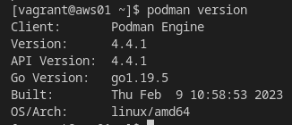
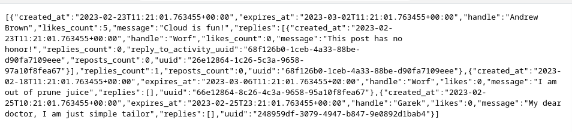

# AWS Cloud Project BootCamp 
### Week 1 Docker and App Containerization

#### Install podman
Install podman from fedora repository 
```
sudo dnf install -y podman
```

Another option to install podman from source code which let you install version specific 
- Install dependencies: 
```
sudo yum install -y \
  btrfs-progs-devel \
  conmon \
  containernetworking-plugins \
  containers-common \
  slirp4netns \
  crun \
  device-mapper-devel \
  git \
  glib2-devel \
  glibc-devel \
  glibc-static \
  go \
  golang-github-cpuguy83-md2man \
  gpgme-devel \
  iptables \
  libassuan-devel \
  libgpg-error-devel \
  libseccomp-devel \
  libselinux-devel \
  make \
  pkgconfig
```

- Install golang 
```
export GOPATH=~/go
git clone https://go.googlesource.com/go $GOPATH
cd $GOPATH
cd src
./all.bash
export PATH=$GOPATH/bin:$PATH
```

- Install conmon 
```
git clone https://github.com/containers/conmon
cd conmon
export GOCACHE="$(mktemp -d)"
make
sudo make podman
```

- Install crun/runc
```
git clone https://github.com/opencontainers/runc.git $GOPATH/src/github.com/opencontainers/runc
cd $GOPATH/src/github.com/opencontainers/runc
make BUILDTAGS="selinux seccomp"
sudo cp runc /usr/bin/runc
```

- Install CNI networking
```
sudo mkdir -p /etc/containers
sudo curl -L -o /etc/containers/registries.conf https://src.fedoraproject.org/rpms/containers-common/raw/main/f/registries.conf
sudo curl -L -o /etc/containers/policy.json https://src.fedoraproject.org/rpms/containers-common/raw/main/f/default-policy.json
```

- Install podman
```
git clone https://github.com/containers/podman/
cd podman
make BUILDTAGS="selinux seccomp systemd"
sudo make install PREFIX=/usr
```

- Verification installation 
```
podman version
```


#### Contranerize Backend Contaner #### 

- Check python version
```  python3 --version ```
``` pip install flask ```
``` pip install flask_cors ```

- Run python Locally 

```
cd backend-flask
export FRONTEND_URL="*"
export BACKEND_URL="*"
python3 -m flask run --host=0.0.0.0 --port=4567
cd ..
``` 
- Verficate the resulte 
http://IP:4567/api/activities/home




- Add Dockerfile 
`
FROM python:3.10-slim-buster

WORKDIR /backend-flask

COPY requirements.txt requirements.txt
RUN pip3 install -r requirements.txt

COPY . .

ENV FLASK_ENV=development

EXPOSE ${PORT}
CMD [ "python3", "-m" , "flask", "run", "--host=0.0.0.0", "--port=4567"]
`

