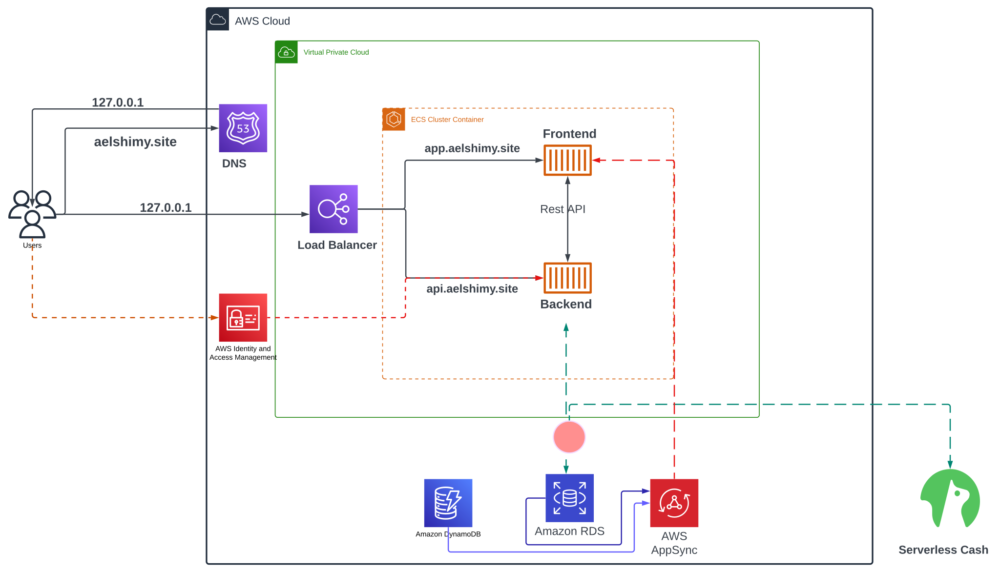

# AWS Cloud Project BootCamp Week 0 

### Activities in AWS:
- Create AWS account.
- Create admin account.
- Secure both accounts with MFA.
- Create billing alarm.

## Activity in Lucid:
- create napkin diagram for an application

